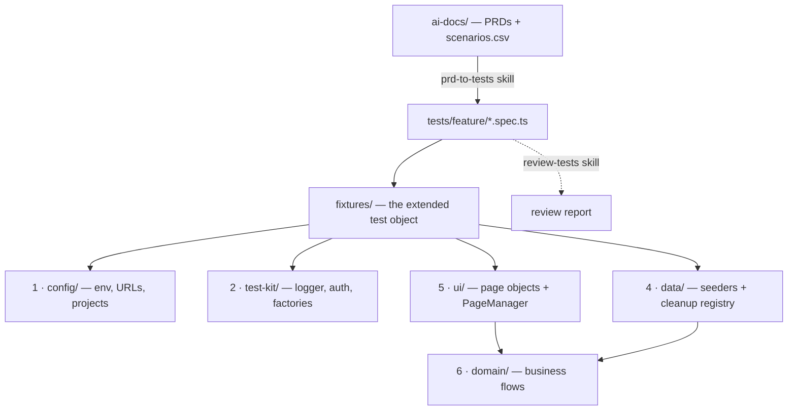

# playwright-portfolio

[](https://github.com/dbanisetty/playwright-portfolio/actions/workflows/ci.yml)

A layered **Playwright + TypeScript** end-to-end framework with an
**AI-assisted authoring workflow**: feature tests are generated from a written
PRD, audited by a review pass, and kept green in CI.

**System under test:** the public
[OrangeHRM open-source demo](https://opensource-demo.orangehrmlive.com) — a full
HR admin application (authentication, role-based access, long data tables,
multi-step forms, search).

---

## Why it's built this way

| Decision | Reason |
|----------|--------|
| **Seven layers; a spec touches only the top** | A broken selector is a `ui/` change; a broken journey is a `domain/` change. Failures land in one place. |
| **An owned `test-kit/`, no external test package** | Every utility is in the repo and explainable — logger, auth, factories, config. |
| **Data setup is deterministic and self-cleaning** | Each seeder registers its teardown *before* it creates the record, so a half-created row is still removed. |
| **Tests are generated from a PRD, then reviewed** | `prd-to-tests` turns acceptance criteria into tagged specs; `review-tests` audits them across five dimensions before they land. |
| **Assisted locator repair, not runtime self-healing** | Self-healing masks real regressions and makes runs non-deterministic. A repair skill proposes locator fixes as a diff for a human to approve *(planned)*. |
| **Never trust the SUT's suggested identifiers** | The shared demo hands out employee IDs that are already taken — tests pin their own. |

---

## Architecture



| # | Layer | Owns |
|---|-------|------|
| 1 | `config/` | Env resolution (zod-validated), base URLs, timeouts, Playwright projects |
| 2 | `test-kit/` | Structured logger, auth roles, faker factories |
| 3 | `reporting/` | Log-sink / artifact wiring |
| 4 | `data/` | UI-driven seeders, `CleanupRegistry` (drained every `afterEach`) |
| 5 | `ui/` | `BasePage`, page objects, shared components, lazy `PageManager` |
| 6 | `domain/` | Multi-page business flows — compose `ui/`, never assert |
| 7 | `tests/` | Specs only — `smoke/` (PR), `feature/` (from PRDs), `api/` |

Specs import `test` / `expect` from `@fixtures`, never from `@playwright/test`.

---

## The AI-assisted workflow

The [`skills/`](skills/) directory holds four version-controlled skills — each a
`SKILL.md` plus reference docs and examples. They are the workflow, kept in the
repo and reviewed like code.

| Skill | Does |
|-------|------|
| [`orangehrm-playwright`](skills/orangehrm-playwright/SKILL.md) | The conventions — golden rules, file map, the 6-step test-writing workflow, reference docs for POM / locators / fixtures / data / config |
| [`prd-to-tests`](skills/prd-to-tests/SKILL.md) | A PRD in `ai-docs/` → tagged specs, plus the page objects / factories / seeders they need |
| [`review-tests`](skills/review-tests/SKILL.md) | Audits specs — coverage, tagging, naming, locators, assertion & wait discipline → one report |
| [`finalize-task`](skills/finalize-task/SKILL.md) | Verify → update status → commit → push → PR |

A feature goes: **write the PRD** → `prd-to-tests` → `review-tests` → fix →
`finalize-task`. The PIM Add Employee suite (11 scenarios) was built this way.

To make the skills discoverable to Claude Code, run once after cloning:

```bash
npm run skills:link   # symlinks skills/ into .claude/skills/ (git-ignored)
```

---

## Getting started

Requires **Node 22** and npm.

```bash
nvm use              # or install Node 22
npm install
npx playwright install chromium
cp .env.example .env
npm test
```

### Commands

| Command | Runs |
|---------|------|
| `npm test` | The full suite |
| `npm run test:smoke` | `@smoke` — fast, no data seeding |
| `npm run test:regression` | `@regression` — full feature coverage |
| `npm run test:headed` | With a visible browser |
| `npm run test:ui` | Playwright UI mode |
| `npm run report` | Open the last HTML report |
| `npm run typecheck` / `npm run lint` | `tsc --noEmit` / ESLint |

### Configuration

All optional — defaults target the demo, headless. Set in `.env`:

| Var | Default | Notes |
|-----|---------|-------|
| `ENV` | `demo` | `demo` \| `local` |
| `BASE_URL` | per `ENV` | Override the base URL |
| `HEADLESS` | `true` | `false` to watch the browser |
| `WORKERS` / `RETRIES` | auto | Override parallelism / retries |

---

## CI

| Workflow | Trigger | Runs |
|----------|---------|------|
| [`ci.yml`](.github/workflows/ci.yml) | push to `main`, every PR | typecheck, lint, `@smoke` |
| [`nightly.yml`](.github/workflows/nightly.yml) | 03:00 UTC daily (+ manual) | full `@regression`, then publishes the report |

CI uploads the Playwright HTML report as an artifact; failing runs also upload
traces. The nightly run publishes its report to **GitHub Pages** —
**[latest regression report →](https://dbanisetty.github.io/playwright-portfolio/)**.

The SUT is a shared public demo, so a run can occasionally go yellow on an
environment hiccup — CI retries failed tests twice.

---

## Layout

```
config/          1 · runtime config factory (zod)
test-kit/        2 · logger, auth, factories
reporting/       3 · log sink / artifacts
data/            4 · seeders + cleanup registry
ui/              5 · BasePage, pages/, components/, PageManager
domain/          6 · business flows
fixtures/            the extended `test` object  (@fixtures)
tests/           7 · smoke/ feature/ api/
ai-docs/            PRDs + scenarios.csv
skills/             orangehrm-playwright · prd-to-tests · review-tests · finalize-task
.github/workflows/  ci.yml · nightly.yml
```

---

## Status

| Phase | Scope | |
|-------|-------|--|
| 0 | Scaffold, seven-layer skeleton, config factory | ✅ |
| 1 | `test-kit`, page objects, fixtures, login smoke suite | ✅ |
| 2 | `orangehrm-playwright` skill, first PRD | ✅ |
| 3 | `prd-to-tests` + `review-tests` skills, Add Employee suite (11 scenarios) | ✅ |
| 4 | GitHub Actions CI, `finalize-task` skill, this README | ✅ |
| 5 | Second target — self-hosted app via Docker + API-driven seeding | planned |
| 6 | `locator-repair` skill wired to the CI failure path | planned |
